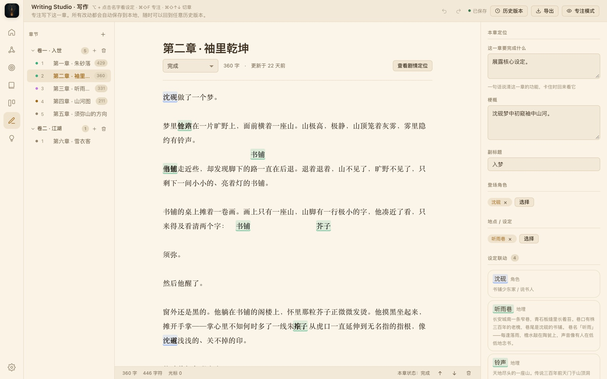

# 芥子 Jièzǐ · 小说创作工作台

> 芥子纳须弥 —— 于方寸之间，容一座须弥世界。

面向长篇小说作者的**桌面端结构化创作工具**：设定管理、大纲规划、正文写作、进度追踪一体，本地优先、离线可用、无需注册。



---

## 核心特性

### 📖 Story Bible · 设定库

先建一座世界，再落笔。

- **角色档案**：全字段 + 自定义字段，性格、欲望、恐惧、弧光一目了然；人物关系、出场与状态全程可追踪
- **世界观条目**：自定义类目、层级结构、条目间双向关联与标签
- **世界规则**：带优先级，写作时参与一致性校验，设定不崩坏
- **反向索引**：改一条设定，立刻看到它被哪些章节、大纲引用

### 🗺️ Story Board · 剧情

先有骨架，再写正文。

- **多级大纲树**：卷 / 幕 / 章 / 场景，拖拽排序，随时转成章节
- **看板视图**：按状态流转，「构思中 → 写作中 → 已完成」
- **故事时间线**：多泳道并行叙事，按故事内时间排序，与现实写作顺序无关
- **伏笔管理**：埋设 → 回收全程追踪，谁还欠着一个交代，系统替你记着

### ✍️ Writing Studio · 写作台

专注写下这一章。

- **沉浸式编辑器**：专注模式、打字机模式、夜间模式，渐进聚焦当前段落
- **设定联动**：正文中出现的角色、地点、条目，悬浮即查档案，不必切走页面
- **自动保存**：所有改动自动落盘，随时可回到任意历史版本
- **实时字数**：光标、字数、字符数在底部常驻，写作节奏心中有数

### 📊 Cockpit · 创作驾驶舱

一本书的进度，一眼看清。

- **创作进度**：总字数、目标进度、章节 / 角色 / 地点 / 事件统计
- **今日与连续**：日目标完成率、连续创作天数
- **创作热力图**：近 20 周活跃一览，看见自己的节奏
- **待办与提醒**：伏笔未回收、章节待写，系统替你记着

### 🤖 AI 助手 · 阿芥

把 AI 请进来，但门由你关。

- 续写、改写、头脑风暴、情节顾问
- 上下文可按「章节 / 角色 / 世界观 / 全书设定」勾选
- 默认接入 DeepSeek，任何 OpenAI 兼容接口（通义、Kimi、Ollama 等）改一行 Base URL 即可
- **不配置 API Key，全部离线功能照常使用**

### 💡 灵感库

随时速记，碎片也有家。

- 灵感与素材整合为单一入口，台词、画面、冷知识按叙事要素归档
- 「归位」动作：把散落的灵感快速归入对应项目与章节
- 移动端随时速记，桌面端整理归档

---

## 下载

当前版本 **v1.4.21** · 免费 · 无内购 · 不收集任何数据

| 平台 | 格式 | 大小 | 下载 |
|---|---|---|---|
| macOS (Apple Silicon) | dmg | ~116 MB | [下载](https://github.com/foolbone/jiezi/releases/download/v1.4.21/jiezi-1.4.21-arm64.dmg) |
| macOS (Apple Silicon) | zip 便携版 | ~110 MB | [下载](https://github.com/foolbone/jiezi/releases/download/v1.4.21/jiezi-1.4.21-arm64-mac.zip) |
| Windows 10/11 (x64) | 安装版 | ~99 MB | [下载](https://github.com/foolbone/jiezi/releases/download/v1.4.21/jiezi-1.4.21-win-x64-Setup.exe) |
| Android | APK (v3.0) | ~4.8 MB | [下载](https://github.com/foolbone/jiezi/releases/download/v1.4.21/jiezi-1.4.21-android.apk) |

> macOS 安装时若提示「身份不明的开发者」：在访达中右键应用 → 打开 即可放行。

### 移动端

移动端采用 **v3.0 双核架构**：聚焦「灵感库 + 正文写作」，随时速记灵感素材，写作页只读速查设定。设定管理、大纲、驾驶舱、导出等完整能力请使用桌面端。iOS 版本构建中。

---

## 数据主权

作品以开放格式存在你的硬盘上，无数据库、无云端、无账号。

```
~/Documents/芥子/
├── settings.json
└── projects/
    └── <项目>/
        ├── project.json      # 设定、角色、大纲、时间线
        ├── content/*.md      # 章节正文
        ├── versions/         # 章节历史版本
        └── backups/          # 项目备份
```

- 可在设置页改到任意目录（比如放进 iCloud / 坚果云同步文件夹）
- 支持导出 TXT / Markdown / DOCX / EPUB / PDF 五种格式
- 自动保存 + 章节版本快照 + 项目备份，写作永不丢失

---

## 技术栈

| 层 | 选型 |
|---|---|
| 桌面壳 | Electron 38 |
| 渲染层 | React 18 + TypeScript |
| 构建 | Vite 5 |
| 状态 | zustand |
| 存储 | 本地文件（JSON + Markdown），无数据库、无云端 |
| 移动端 | Capacitor + 原生组件 |
| 导出 | docx / fast-xml-parser |

---

## 开发

```bash
# 安装依赖
npm install

# 开发模式（vite dev server + electron 热重载）
npm run dev

# 类型检查
npm run typecheck

# 构建
npm run build

# 打包 macOS（dmg + zip）
npm run dist:mac

# 端到端冒烟测试
npm run smoke
```

### AI 配置

打开应用内「设置」页：

- **Base URL**：`https://api.deepseek.com/v1`（默认已填）
- **API Key**：你的 DeepSeek Key
- **模型**：`deepseek-chat`

任何兼容 OpenAI 接口的服务（通义、Kimi、本地 Ollama）改 Base URL 即可。

---

## 品牌与设计

- 品牌基调：宣纸 · 墨 · 朱砂（东方极简 / 文人气 / 留白）
- 核心母题：ensō 一笔圆（禅意 · 不完美中的完整 · 留白）
- 字体：标题 Songti SC / Noto Serif SC，正文 PingFang SC / Noto Sans SC
- 设计规范见 [brand/design-system.html](brand/design-system.html)（主项目仓库）

---

## 许可证

MIT License. 自由使用、修改、分发。

---

**官网**：https://www.jiezistory.cn
